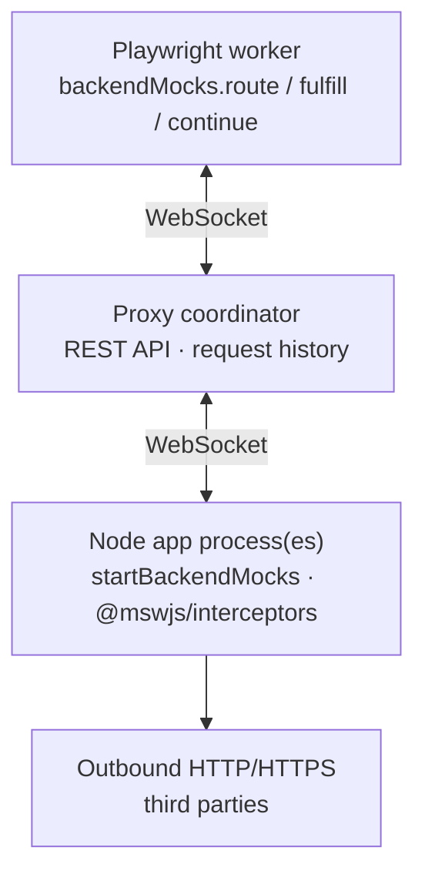

# Concepts

A small architecture with three roles. Understanding them makes every other page in these docs obvious.

## Architecture

1. **Node agent** pauses an outbound request and asks the proxy what to do.
2. **Proxy** asks every Playwright test with active routes whether it claims the request, waits for all replies, then picks an owner (or passthrough / ambiguous failure).
3. **Playwright fixture** evaluates matchers locally, runs the winning route handler, and returns a decision (`fulfill`, `continue`, `abort`, or a `fetch` round-trip).

You almost never interact with the protocol directly. You write tests against `backendMocks` and start the agent + proxy around your app.

## The packages you use day to day

| Package                                | Role                                                           |
| -------------------------------------- | -------------------------------------------------------------- |
| `@playwright-backend-mocks/proxy`      | CLI process that coordinates matching and exposes the REST API |
| `@playwright-backend-mocks/node`       | Agent installed in each Node process under test                |
| `@playwright-backend-mocks/playwright` | `test` fixture exposing `backendMocks`                         |
| `@playwright-backend-mocks/dashboard`  | Optional separate Vue UI that consumes the proxy REST API      |

`@playwright-backend-mocks/protocol` is shared wire types for the packages above. Application tests rarely import it.

## Route lifecycle

1. A test calls `backendMocks.route(matcher, handler)`.
2. The fixture keeps the matcher/handler locally and registers the route with the proxy for the current `testId`.
3. When a Node agent reports an outbound request, the proxy broadcasts a claim to every test with active routes and waits for all replies.
4. On a single claim, your handler runs and must settle with `fulfill`, `continue`, or `abort`.
5. When the test ends, routes are unregistered automatically.

## Matching outcomes

| Matches | Result                                                                   |
| ------- | ------------------------------------------------------------------------ |
| **0**   | Passthrough — the Node process continues the real request                |
| **1**   | Your handler runs                                                        |
| **>1**  | Ambiguous — the Node request fails and Playwright receives a proxy error |

Design matchers so concurrent tests (or overlapping routes in one test) stay unambiguous. Prefer method / `clientId` filters when URLs collide.

## Passthrough by default

Unmatched traffic is **not** blocked. That keeps setup light, but it also means a missing route can hit a real service. Prefer explicit mocks for anything external or costly, and use the [REST API](/reference/rest-api) or [dashboard](/reference/dashboard) while writing tests to confirm what was mocked vs passed through.

## Test scope vs worker scope

- **Worker:** one WebSocket from the Playwright worker to the proxy (shared across tests in that worker).
- **Test:** each test gets its own `backendMocks` instance, `testId`, and route set.

Routes never leak across tests. Observed requests and drained errors belong to the current test only.
