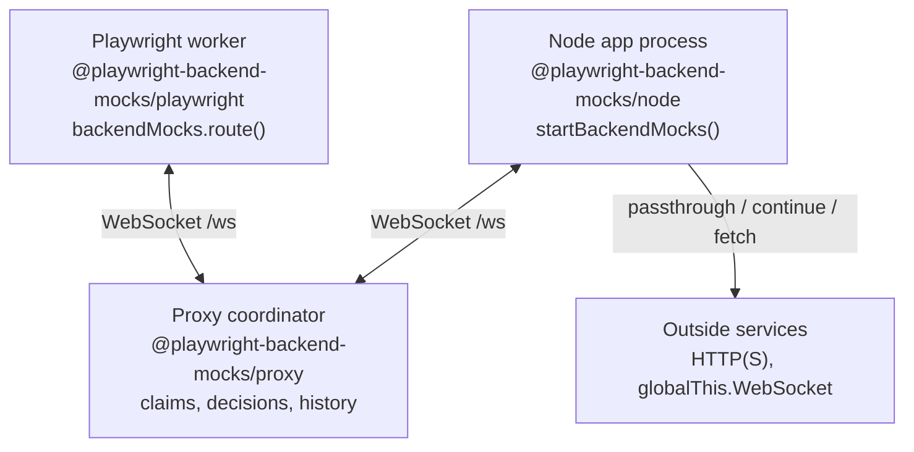

# Concepts

Playwright Backend Mocks has three moving parts: a Playwright fixture, a proxy coordinator, and one or more Node agents.

## Architecture



| Process | Package | Responsibility |
| --- | --- | --- |
| Playwright worker | `@playwright-backend-mocks/playwright` | Exposes `backendMocks`, stores live handlers, evaluates matchers, settles routes. |
| Proxy coordinator | `@playwright-backend-mocks/proxy` | Tracks tests/routes/connections, broadcasts claims, records history, exposes REST diagnostics. |
| Node app process | `@playwright-backend-mocks/node` | Installs `@mswjs/interceptors`, pauses outbound HTTP, applies the proxy decision. |

`@playwright-backend-mocks/protocol` contains shared wire types and validators. Most tests do not import it.

## Route lifecycle

1. A test registers `await backendMocks.route(matcher, handler)`. The promise resolves after the proxy has the route.
2. The fixture keeps the handler in the Playwright worker and registers matcher metadata with the proxy.
3. A Node agent sees outbound HTTP and sends `request:start` to the proxy.
4. The proxy asks every active test route set whether it claims the request.
5. The proxy chooses a single owning test, no owner, or a loud ambiguity.
6. The winning test handler calls `fulfill`, `continue`, `abort`, `fallback`, or `fetch`.
7. The proxy relays the decision to Node and records the outcome.

## Claim outcomes

| Claiming tests | Outcome | What Node sees |
| --- | --- | --- |
| `0` | Passthrough | The original request goes to the real network. |
| `1` | Owned by that test | The test handler decides the response. |
| `>1` | `ambiguous_route` | The request fails with an error. |

::: danger
`ambiguous_route` means two different tests claimed the same backend request. It is not caused by multiple handlers in one test. Fix the suite scoping instead of draining the error permanently.
:::

## Handler order inside one test

HTTP handlers follow Playwright's route order:

- Newest matching route runs first.
- `route.fulfill()`, `route.continue()`, and `route.abort()` are terminal.
- `route.fallback()` is non-terminal and lets the next matching handler run.
- If the chain falls through, the request continues upstream.

WebSocket routes use newest matching handler only. There is no WebSocket fallback chain.

## Test and worker scope

The Playwright package creates:

| Scope | Resource |
| --- | --- |
| Worker | One connection to the proxy. |
| Test | One `backendMocks` instance with its own `testId`, request history view, and error buffer. |

Routes are unregistered when the test ends. Errors left in the test buffer fail fixture teardown as an `AggregateError`; use `backendMocks.takeErrors()` only for tests that intentionally trigger a proxy failure.

## History and diagnostics

The proxy records recent traffic in memory. Use:

```bash
curl http://127.0.0.1:4310/api/history
curl http://127.0.0.1:4310/api/connections
```

See [REST API](/ops/rest-api) and [Troubleshooting](/guide/troubleshooting).
