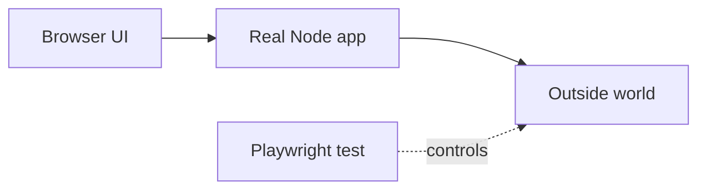
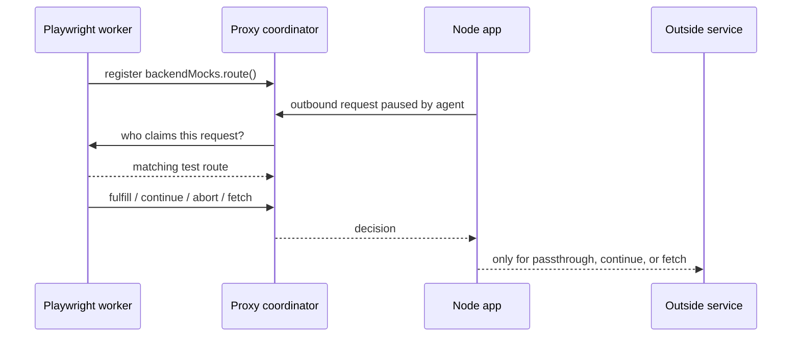

# Philosophy

Playwright Backend Mocks exists for one purpose:

**Run the real app. Mock only the outside world.**

Good end-to-end tests should exercise the UI and server together. The things you fake are the third-party boundaries: payment APIs, email providers, identity services, and other systems your product depends on but does not own.

Browser `page.route()` only sees browser traffic. It cannot see outbound HTTP made by your Node server. This library gives that server-side traffic a Playwright-shaped mocking API, without asking you to add test-only branches or dependency injection wrappers to application code.

## The intention

The app still boots like production. Your Playwright test registers routes for the external calls you care about. Everything else can pass through unless you choose to intercept it.

## Playwright is the oracle

The API aims to mirror Playwright network interception closely:

- `backendMocks.route()` follows the shape of `page.route()`.
- Route handlers use `route.fulfill()`, `route.continue()`, `route.abort()`, `route.fallback()`, and `route.fetch()`.
- Request and response accessors are methods: `request.method()`, `request.url()`, `await response.json()`, `response.status()`.
- HAR and WebSocket APIs use Playwright names: `routeFromHAR()` and `routeWebSocket()`.

The repository keeps a parity suite under `tests/parity/` that runs against Playwright itself and against this library. That suite is the executable contract for the developer experience.

## Three processes, one coordinator

This split is the reason the app does not need test seams. The Node agent pauses traffic. The proxy coordinates ownership. The Playwright test owns the mock logic.

## Parity, with deliberate Node differences

The library is intentionally close to Playwright, but Node and multi-process tests introduce a few product differences:

| Difference | Why it exists |
| --- | --- |
| `clientId` matchers | Multiple Node processes can share one proxy. |
| Cross-test `ambiguous_route` errors | Two tests claiming the same Node request is a test architecture bug. |
| `globalThis.WebSocket` only | The current WebSocket bridge patches the platform WebSocket, not npm `ws`. |
| Node request stubs | Browser-only concepts such as frames, service workers, and navigation requests do not apply. |

::: warning
WebSocket interception is limited to application code that uses `globalThis.WebSocket`. See [WebSockets](/guide/websockets) before relying on WebSocket mocks.
:::

## Concurrency should fail loud

Playwright routes are scoped to one page. Backend routes are scoped to Node processes that may serve many tests at once.

If a single Node request matches routes from two different tests, the proxy fails the request with `ambiguous_route` and records a proxy error for the claiming tests. Within one test, HTTP still follows Playwright's newest-first handler order with `fallback()`.

Use `clientId`, method filters, URL scoping, isolated app processes, or serial test groups so concurrent tests do not claim the same backend request.

## Where to go next

- [Concepts](/guide/concepts) explains claim outcomes and process roles.
- [Network mocking](/guide/network-mocking) gives the HTTP mocking overview.
- [Limitations](/guide/limitations) lists the current boundaries.
