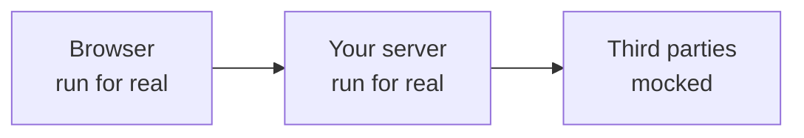

# Why this library

Good end-to-end tests should cover your **entire application** — the UI _and_ the server — and mock **only at the boundaries**.

That sounds obvious. In Playwright suites it is surprisingly rare.

## The usual tradeoffs

Playwright can mock what the **browser** fetches (`page.route()`). It cannot see outbound HTTP from your **Node** process — payments, email, SMS, auth providers, internal HTTP APIs called from the server.

So teams fall into one of these traps:

1. **Skip the server** — drive the UI against a stubbed or mocked API layer, and never run real server code.
2. **Hit real third parties** — flaky, slow, credential-heavy, and unsafe for failure injection.
3. **Plant fakes inside the app** — test-only branches, DI seams, or module mocks that diverge from production.

None of those are “run the real app, mock the outside world.”

## What “mock at the boundaries” means



- Your checkout page is real.
- Your API route / server action / worker that charges the card is real.
- Stripe (or whatever sits outside your system) is mocked.

That is the test you actually want when you say e2e.

## How this library makes it easy

Playwright Backend Mocks gives your tests a `backendMocks` fixture with the same mental model as browser routing:

```ts
test("handles a declined payment", async ({ page, backendMocks }) => {
  await backendMocks.route("https://payments.example.test/charges", async (route) => {
    await route.fulfill({
      status: 402,
      json: { error: "card_declined" },
    });
  });

  await page.goto("/checkout");
  await page.getByRole("button", { name: "Pay" }).click();
  await expect(page.getByText("Your card was declined")).toBeVisible();
});
```

The payment URL is called by your **Node** process. The handler still looks like Playwright. Your app code stays free of test seams.

## Concrete payoffs

- **Third-party APIs** — payments, email, SMS, auth, analytics — without sandboxes or rate limits.
- **Failure paths** — timeouts, connection refused, DNS failures that are painful against real services.
- **Deterministic e2e** — stable bodies and status codes; assertions stop flickering.
- **Multi-process apps** — API server and workers mocked independently via `clientId`.
- **Request assertions** — prove the server called the right URL/method/body with `waitForRequest`.

## What it is not

- Not a replacement for `page.route()` — use both when the browser _and_ the server talk to the outside world.
- Not a general HTTP proxy for browsers or non-Node clients.
- Not an interceptor for gRPC, raw TCP, or non-global WebSocket clients (npm `ws`, etc.). Application `globalThis.WebSocket` mocking is on the rewrite roadmap — see [Limitations](/guide/limitations).

See [Limitations](/guide/limitations) for the v1 boundary, or [get started](/guide/getting-started) and wire it into a suite.
