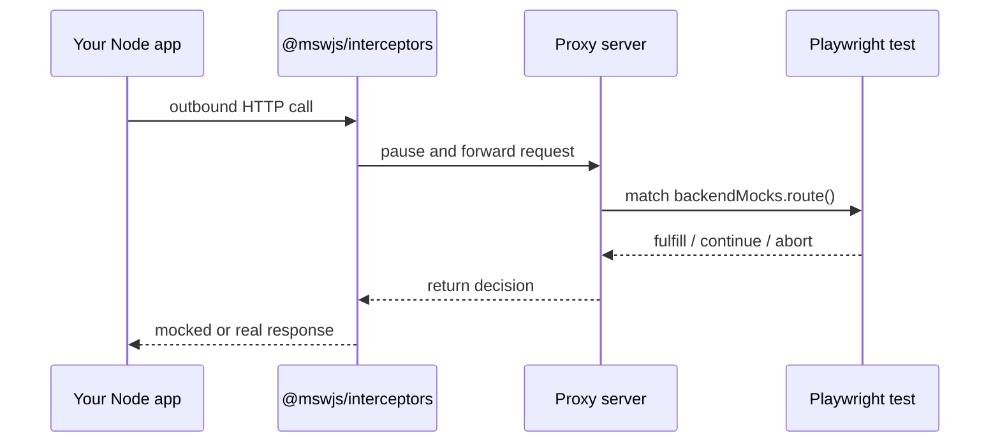

## Mock Node.js outbound requests from Playwright

Your UI and server stay real. `backendMocks.route()` targets the outbound HTTP your Node process makes — the calls that never show up in the browser Network tab.

```ts
test("declined card shows an error", async ({ page, backendMocks }) => {
  await backendMocks.route("https://api.stripe.com/**", async (route) => {
    await route.fulfill({
      status: 402,
      json: { error: "card_declined" },
    });
  });

  await page.goto("/checkout");
  await page.getByRole("button", { name: "Pay" }).click();
  await expect(page.getByText("Your card was declined")).toBeVisible();
});
```

## Familiar API — mock, spy, modify, abort

If you know `page.route()`, you already know this shape: `fulfill`, `fetch`, `continue`, and `abort` — plus request spying for what your server actually called.

::: code-group

```ts [Mock]
test("shows a declined card error", async ({ page, backendMocks }) => {
  await backendMocks.route("https://api.stripe.com/**", async (route) => {
    await route.fulfill({
      status: 402,
      json: { error: "card_declined" },
    });
  });

  await page.goto("/checkout");
  await page.getByRole("button", { name: "Pay" }).click();
  await expect(page.getByText("Your card was declined")).toBeVisible();
});
```

```ts [Spy]
test("charges the expected amount", async ({ page, backendMocks }) => {
  await backendMocks.route("https://api.stripe.com/v1/charges", async (route) => {
    await route.continue(); // real upstream — just observe
  });

  const pending = backendMocks.waitForRequest("https://api.stripe.com/v1/charges");

  await page.goto("/checkout");
  await page.getByRole("button", { name: "Pay" }).click();

  const charge = await pending;
  expect(charge.method()).toBe("POST");
  expect(charge.postDataJSON()).toEqual({ amount: 2000, currency: "usd" });
});
```

```ts [Modify]
test("renders an extra user from a modified upstream response", async ({
  page,
  backendMocks,
}) => {
  await backendMocks.route("https://api.example.test/users", async (route) => {
    const upstream = await route.fetch();
    const users = (await upstream.json()) as Array<{ id: number; name: string }>;
    users.push({ id: 100, name: "Injected" });
    await route.fulfill({ response: upstream, json: users });
  });

  await page.goto("/users");
  await expect(page.getByText("Injected")).toBeVisible();
});
```

```ts [Abort]
test("shows a timeout message when payments hang", async ({ page, backendMocks }) => {
  await backendMocks.route("https://api.stripe.com/**", async (route) => {
    await route.abort("timedout");
  });

  await page.goto("/checkout");
  await page.getByRole("button", { name: "Pay" }).click();
  await expect(page.getByText(/timed out|try again/i)).toBeVisible();
});
```

:::

## Simple Node.js setup that stays out of the way

Add one startup call. Under the hood it uses [@mswjs/interceptors](https://www.npmjs.com/package/@mswjs/interceptors) to catch outbound HTTP (and `globalThis.WebSocket`), so you configure mocks in Playwright and write the rest of your app exactly as you otherwise would — no test-only branches, wrappers, or dependency-injection seams for Stripe, email, and friends.

```ts
import { startBackendMocks } from "@playwright-backend-mocks/node";

if (process.env.PLAYWRIGHT_BACKEND_MOCKS_PROXY_URL !== undefined) {
  await startBackendMocks({
    proxyUrl: process.env.PLAYWRIGHT_BACKEND_MOCKS_PROXY_URL,
    clientId: "api-server",
  });
}

// The rest of your app is unchanged — keep using fetch, http, axios, etc.
```

## Compatible with your HTTP client

Because interception happens at the lowest level through `@mswjs/interceptors`, this library can capture and mock requests from virtually every Node HTTP client and the frameworks and SDKs built on top of them — without rewriting how your app talks to the network.

<CompatibilityLogos />

## Not magic — a proxy your Playwright tests control

Your app still runs for real. We intercept the HTTP it sends to the outside world, then let the test decide what happens next.

1. **Start a proxy** — a small local process between your Node app and Playwright. It matches routes, returns decisions, and exposes request history over REST.
2. **Route Node HTTP through it** — `startBackendMocks()` catches outbound `fetch` / `http` / `https` calls and sends them to the proxy instead of going straight to Stripe, email, etc.
3. **Control it from Playwright** — your test calls `backendMocks.route(...)`. When the app makes a matching request, the handler runs in Playwright — fulfill a mock, continue upstream, or abort — and Node gets that result.



Unmatched requests pass through to the real network. Outside tests, with no proxy URL set, the Node agent is a no-op.

## Inspect traffic while you debug

While the proxy is running, inspect HTTP and WebSocket traffic — including which test owned it and what action it took — via the optional [dashboard](/ops/dashboard) or the [REST API](/ops/rest-api):

- `GET /api/history` — HTTP timeline
- `GET /api/ws` — WebSocket connections and events
- `GET /api/history/:id/har` — download one HTTP request as HAR (for `routeFromHAR`)

Local coding agents can use the same REST surface; see [Observability](/ops/observability).

## Ready to wire it into a suite?

Four steps: start the proxy, enable the Node agent, compose the fixture, write your first route.

- [Get started](/guide/getting-started)
- [Why this library](/guide/philosophy)
