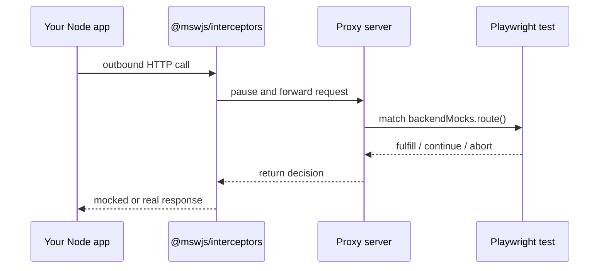

# `@playwright-backend-mocks/playwright`

[](https://www.npmjs.com/package/@playwright-backend-mocks/playwright)
[](https://github.com/danielshawellis/playwright-backend-mocks/actions/workflows/ci.yml)
[](https://github.com/danielshawellis/playwright-backend-mocks/blob/main/LICENSE)
[](https://nodejs.org)

Playwright fixtures for mocking outbound Node.js HTTP (and WebSockets) from your tests — the test-side half of [Playwright Backend Mocks](https://danielshawellis.github.io/playwright-backend-mocks/).

**[Documentation](https://danielshawellis.github.io/playwright-backend-mocks/)** · **[Getting started](https://danielshawellis.github.io/playwright-backend-mocks/guide/getting-started)** · **[API](https://danielshawellis.github.io/playwright-backend-mocks/api/backend-mocks)** · **[GitHub](https://github.com/danielshawellis/playwright-backend-mocks)**

## Run the real app. Mock only the outside world.

Good e2e tests cover your UI and your server — then fake Stripe, email, and every other third party at the boundary. Playwright can do the browser half. This library makes the server half just as easy.

Your UI and server stay real. `backendMocks.route()` targets the outbound HTTP your Node process makes — the calls that never show up in the browser Network tab.

```ts
test("declined card shows an error", async ({ page, backendMocks }) => {
  await backendMocks.route("https://api.stripe.com/**", async (route) => {
    await route.fulfill({
      status: 402,
      json: { error: "card_declined" },
    });
  });

  await page.goto("/checkout");
  await page.getByRole("button", { name: "Pay" }).click();
  await expect(page.getByText("Your card was declined")).toBeVisible();
});
```

If you know `page.route()`, you already know this shape: `fulfill`, `fetch`, `continue`, and `abort` — plus request spying for what your server actually called.

## Role in the system

This package is what your Playwright tests import. It exposes the `backendMocks` fixture: live route handlers, matchers, `waitForRequest` / HAR helpers, and WebSocket routing. Handlers run in the Playwright worker; the [proxy](https://www.npmjs.com/package/@playwright-backend-mocks/proxy) coordinates with the [Node agent](https://www.npmjs.com/package/@playwright-backend-mocks/node).

| Process | Package | Responsibility |
| --- | --- | --- |
| **Playwright worker** | **`@playwright-backend-mocks/playwright`** | `backendMocks.route()`, matching, settle (`fulfill` / `continue` / `abort` / …) |
| Proxy coordinator | `@playwright-backend-mocks/proxy` | Claims, decisions, history, REST |
| Node app | `@playwright-backend-mocks/node` | Intercepts outbound HTTP / WebSocket |

## Install

```bash
npm install -D @playwright/test@1.62.1 \
  @playwright-backend-mocks/playwright \
  @playwright-backend-mocks/node \
  @playwright-backend-mocks/proxy
```

Keep the `@playwright-backend-mocks/*` packages on the same version.

## Compose the fixture

```ts
import { mergeTests } from "@playwright/test";
import { test as backendMocksTest } from "@playwright-backend-mocks/playwright";
import { test as appTest } from "./application-fixtures";

export const test = mergeTests(appTest, backendMocksTest);
export { expect } from "@playwright/test";
```

Point Playwright at the proxy (usually via `webServer`) and set `backendMocksProxyUrl` — see the [getting started guide](https://danielshawellis.github.io/playwright-backend-mocks/guide/getting-started).

## How it works

1. **Start a proxy** — a small local process between your Node app and Playwright.
2. **Route Node HTTP through it** — `startBackendMocks()` in the app catches outbound calls.
3. **Control it from Playwright** — `backendMocks.route(...)` handlers decide fulfill / continue / abort.



Unmatched requests pass through to the real network.

## Related packages

| Package | Role |
| --- | --- |
| [`@playwright-backend-mocks/node`](https://www.npmjs.com/package/@playwright-backend-mocks/node) | Agent that intercepts outbound traffic in the app |
| [`@playwright-backend-mocks/proxy`](https://www.npmjs.com/package/@playwright-backend-mocks/proxy) | Coordinator + REST history API |
| [`@playwright-backend-mocks/dashboard`](https://www.npmjs.com/package/@playwright-backend-mocks/dashboard) | Optional read-only traffic UI |
| [`@playwright-backend-mocks/protocol`](https://www.npmjs.com/package/@playwright-backend-mocks/protocol) | Shared wire types (usually a transitive dependency) |

## License

MIT
