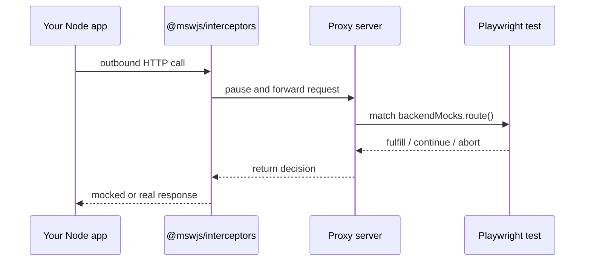

# `@playwright-backend-mocks/proxy`

[](https://www.npmjs.com/package/@playwright-backend-mocks/proxy)
[](https://github.com/danielshawellis/playwright-backend-mocks/actions/workflows/ci.yml)
[](https://github.com/danielshawellis/playwright-backend-mocks/blob/main/LICENSE)
[](https://nodejs.org)

Standalone proxy, coordinator, and REST API for [Playwright Backend Mocks](https://danielshawellis.github.io/playwright-backend-mocks/) — the process that sits between your Playwright tests and Node app.

**[Documentation](https://danielshawellis.github.io/playwright-backend-mocks/)** · **[Getting started](https://danielshawellis.github.io/playwright-backend-mocks/guide/getting-started)** · **[Proxy ops](https://danielshawellis.github.io/playwright-backend-mocks/ops/proxy)** · **[GitHub](https://github.com/danielshawellis/playwright-backend-mocks)**

## Run the real app. Mock only the outside world.

Good e2e tests cover your UI and your server — then fake Stripe, email, and every other third party at the boundary. Playwright can do the browser half. This library makes the server half just as easy.

Your UI and server stay real. Tests use `backendMocks.route()` for the outbound HTTP your Node process makes — the calls that never show up in the browser Network tab.

```ts
test("declined card shows an error", async ({ page, backendMocks }) => {
  await backendMocks.route("https://api.stripe.com/**", async (route) => {
    await route.fulfill({
      status: 402,
      json: { error: "card_declined" },
    });
  });

  await page.goto("/checkout");
  await page.getByRole("button", { name: "Pay" }).click();
  await expect(page.getByText("Your card was declined")).toBeVisible();
});
```

## Role in the system

This package is the **coordinator**. Playwright workers and Node agents connect over WebSockets. When the app reports outbound traffic, the proxy broadcasts claims, picks an owning test (or passthrough / loud ambiguity), relays the settle decision back to Node, and records history for debugging.

| Process | Package | Responsibility |
| --- | --- | --- |
| Playwright worker | `@playwright-backend-mocks/playwright` | `backendMocks.route()`, matching, settle |
| **Proxy coordinator** | **`@playwright-backend-mocks/proxy`** | Claims, decisions, history, REST |
| Node app | `@playwright-backend-mocks/node` | Intercepts outbound HTTP / WebSocket |

It is not magic — a small local process your Playwright tests control:

1. **Start the proxy** — matches routes, returns decisions, exposes request history over REST.
2. **Route Node HTTP through it** — `startBackendMocks()` pauses outbound calls and asks the proxy.
3. **Control it from Playwright** — handlers run in the test and fulfill / continue / abort.



## Install

```bash
npm install -D @playwright-backend-mocks/proxy \
  @playwright-backend-mocks/playwright \
  @playwright-backend-mocks/node
```

Keep the `@playwright-backend-mocks/*` packages on the same version.

## CLI

Binary: `playwright-backend-mocks-proxy`

```bash
playwright-backend-mocks-proxy --host 127.0.0.1 --port 4310
```

Typical Playwright `webServer` entry:

```ts
{
  command: "playwright-backend-mocks-proxy --host 127.0.0.1 --port 4310",
  url: "http://127.0.0.1:4310/health",
  reuseExistingServer: !process.env.CI,
}
```

While the proxy is running you can inspect traffic via REST (or the optional [dashboard](https://www.npmjs.com/package/@playwright-backend-mocks/dashboard)):

- `GET /api/history` — HTTP timeline
- `GET /api/ws` — WebSocket connections and events
- `GET /api/history/:id/har` — download one HTTP request as HAR

See [Observability](https://danielshawellis.github.io/playwright-backend-mocks/ops/observability).

## Related packages

| Package | Role |
| --- | --- |
| [`@playwright-backend-mocks/playwright`](https://www.npmjs.com/package/@playwright-backend-mocks/playwright) | Playwright `backendMocks` fixture |
| [`@playwright-backend-mocks/node`](https://www.npmjs.com/package/@playwright-backend-mocks/node) | Agent that intercepts outbound traffic in the app |
| [`@playwright-backend-mocks/dashboard`](https://www.npmjs.com/package/@playwright-backend-mocks/dashboard) | Optional read-only traffic UI |
| [`@playwright-backend-mocks/protocol`](https://www.npmjs.com/package/@playwright-backend-mocks/protocol) | Shared wire types (usually a transitive dependency) |

## License

MIT
